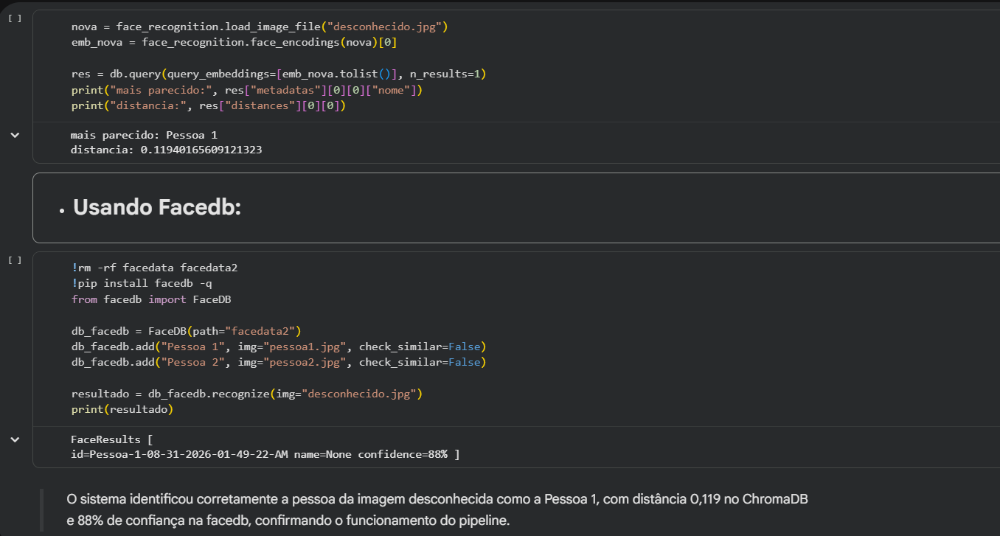

<div align="center">

## Masked Face Recognition Pipeline

[](https://colab.research.google.com/drive/1ATRRCVrzh37h7hFUbNL8BefTb4DW39Uu?usp=sharing)
[](https://www.python.org/)
[](LICENSE)
[](https://www.pucrs.br/)

*Projeto prático e teórico desenvolvido para a disciplina de **Introdução à Visão Computacional** na **PUCRS**, abordando os desafios do reconhecimento facial na era da COVID-19 e a implementação de um pipeline de busca vetorial.*

---

</div>

## Visão Geral

Este repositório reúne a resolução do trabalho acadêmico estruturado em duas etapas principais:
1. **Pesquisa Acadêmica:** Análise do artigo *"A survey on computer vision based human analysis in the COVID-19 era"*, cobrindo o impacto do uso de máscaras faciais em sistemas de visão computacional, soluções de detecção/reconhecimento e levantamento de datasets.
2. **Demonstração Prática (Notebook):** Construção de um pipeline completo em Python para download de imagens, extração de embeddings faciais de 128D, cálculo de similaridade e busca vetorial com **ChromaDB** e **FaceDB** sobre um conjunto de teste com 3 imagens (`pessoa1.jpg`, `pessoa2.jpg` e `desconhecido.jpg`).

---

## Parte 1: Pesquisa Teórica

### 1. Impacto das Máscaras Faciais na Visão Computacional
O uso em massa de máscaras durante a pandemia removeu grande parte da informação útil do rosto, atuando como **ruído estruturado** (padrões de cor, dobras e estampas sem relação com a identidade). O modelo perde sinal descritivo e ganha ruído irrelevante: duas pessoas distintas com máscaras parecidas tornam-se mais semelhantes para a rede, enquanto a mesma pessoa com e sem máscara perde similaridade.

### 2. Técnicas Desenvolvidas
* **Detecção (Com/Sem/Máscara Incorreta):** Uso de detectores como MTCNN, RetinaFace, SSD e variações da YOLO (v2, v3, v5) combinados com classificadores (Inception-v3, MobileNetV2, EfficientNet). Destacam-se o `SSDMNV2` (leve para celulares), `SE-YOLOv3` e `SRCNet` (super-resolução para faces pequenas).
* **Reconhecimento Facial:**
  1. *In-painting:* Reconstrução digital da parte coberta.
  2. *Template Unmasking:* Ajuste do vetor de características para simular a face sem máscara.
  3. *Otimização do Modelo:* Retreino com funções de perda adaptadas (ArcFace multitarefa, *triplet loss*).
  4. *Reconhecimento Periocular:* Uso exclusivo da região dos olhos e sobrancelhas.

### 3. Datasets Analisados
* **Bases Reais:** `MAFA` (30k+ imagens), `ISL-UFMD/ISL-UFHD` (foco em diversidade étnica/uso correto e incorreto) e `BAFMD`.
* **Bases Sintéticas:** `MaskedFace-Net` (137k imagens) e `MS1MV2-Masked` (~57,5M de imagens).

---

## Parte 2: Pipeline Prático (Notebook)

A implementação prática valida o fluxo de busca vetorial utilizando 3 imagens baixadas via Google Drive (`gdown`): `pessoa1.jpg`, `pessoa2.jpg` e uma imagem de teste `desconhecido.jpg`.

### Fluxo de Execução:
1. **Download & Exibição:** Obtenção das 3 imagens via `gdown` e verificação visual com `PIL`.

| Pessoa 1 | Pessoa 2 | Desconhecido |
| :---: | :---: | :---: |
|  |  |  |

2. **Detecção & Embeddings (`face_recognition`):**
   * Detecção da face via algoritmo `HOG`.
   * Geração do vetor/embedding de 128 dimensões da `pessoa1.jpg`.
3. **Comparação de Similaridade (`pessoa1` vs `pessoa2`):**
   * Cálculo de similaridade de cosseno (resultado ~`0.87`).
   * Métrica oficial de distância euclidiana (`0.738` -> confirmado como pessoas diferentes, pois requer `< 0.6`).
4. **Indexação e Busca Vetorial com ChromaDB:**
   * Cadastro dos vetores da `pessoa1` e `pessoa2` no banco vetorial.
   * Consulta do embedding da imagem `desconhecido.jpg`.
   * **Resultado ChromaDB:** Retornou `Pessoa 1` com distância de `0.119`.
5. **Reconhecimento Simplificado com FaceDB:**
   * Recriação da base e teste de reconhecimento direto.
   * **Resultado FaceDB:** Identificou `Pessoa 1` com **88% de confiança**.

   

---

## 🛠️ Pipeline Prático Implementado

O notebook implementa um fluxo completo de identificação e busca por similaridade vetorial:

```
┌────────────────────┐
│ Imagem de Entrada  │
└─────────┬──────────┘
          │
          ▼
┌────────────────────┐
│  Detector de Face  │ ──► Localiza a ROI (Region of Interest)
└─────────┬──────────┘
          │
          ▼
┌────────────────────┐
│  Rede Neural CNN   │ ──► Converte a face em um Embedding (Vetor de 128D)
└─────────┬──────────┘
          │
          ▼
┌────────────────────┐
│   Banco Vetorial   │ ──► Realiza busca por similaridade (1-NN / Cosseno / Euclidiana)
└────────────────────┘
```

### Resultados dos Testes Práticos
* **Métrica de Distância Euclidiana (`face_recognition`):** Limiar oficial menor que 0.6 indica a mesma pessoa.
* **ChromaDB:** Identificou com precisão a pessoa correspondente no banco vetorial (*distância de 0.119*).
* **FaceDB:** Classificou e reconheceu a face com **88% de confiança**.

---

## Estrutura do Repositório

```
masked-face-recognition-pipeline/
├── data/                           # Imagens de exemplo utilizadas no teste
├── notebooks/
│   └── reconhecimento_facial.ipynb # Notebook principal do Colab
├── .gitignore                      # Arquivo para ignorar os bancos locais gerados
├── LICENSE                         # Licença do repositório
└── README.md                       # Documentação do projeto
```

## Como Executar

### Opção 1: Executar Direto no Google Colab
Clique no selo no topo deste README ou acesse o notebook no Colab para rodar o código na nuvem.

### Opção 2: Executar Localmente

1. **Clone o repositório:**
   ```
   git clone [https://github.com/lucasnk1/masked-face-recognition-pipeline.git](https://github.com/lucasnk1/masked-face-recognition-pipeline.git)
   cd masked-face-recognition-pipeline
   ```

2. **Instale as dependências necessárias:**
   ```
   pip install face_recognition chromadb facedb gdown
   ```
3. **Inicie o Jupyter Notebook:**
   ```
   jupyter notebook notebooks/reconhecimento_facial.ipynb
   ```

## Stacks utilizadas

* **Linguagem:** Python 3.10+

* **Visão Computacional & Embeddings:** face_recognition, Pillow, NumPy

* **Bancos de Dados Vetoriais:** ChromaDB, FaceDB

* **Download de Dados:** gdown

## Autor

**Lucas Leuck de Oliveira**

* **Instituição:** Pontifícia Universidade Católica do Rio Grande do Sul (PUCRS)

* **Curso:** Escola Politécnica / Introdução à Visão Computacional

* **Professora:** Daniela Oliveira Ferreira do Amaral

   
